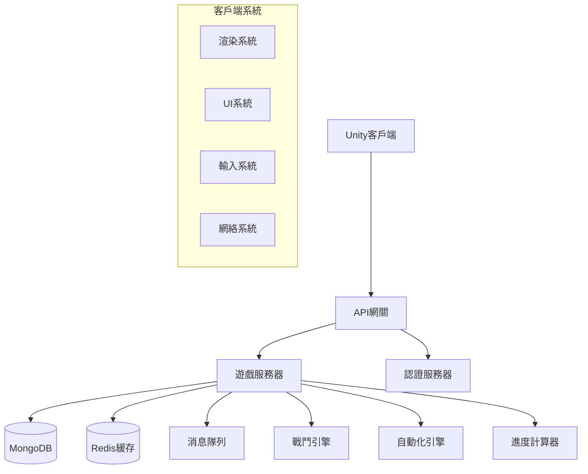
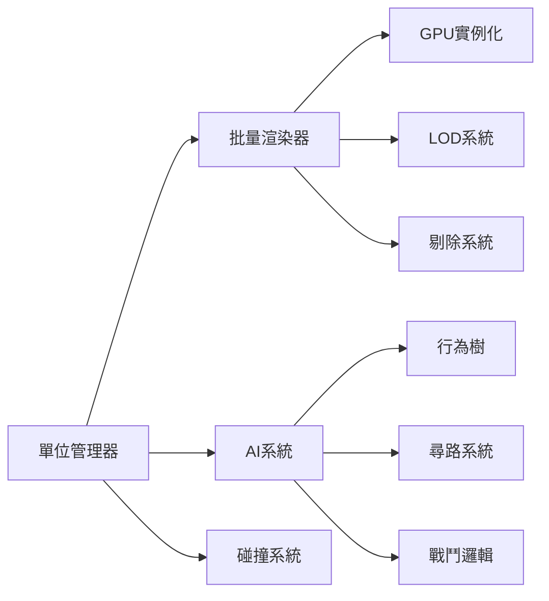
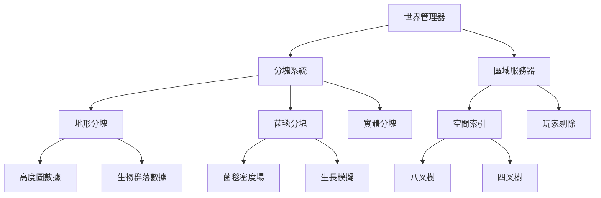
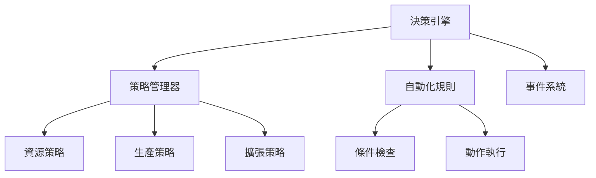
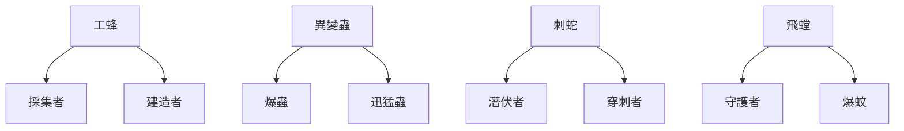

# 深淵巢穴 Idle RTS 全盤開發計劃 - 設計文檔

## 概述

本設計文檔詳細描述了深淵巢穴 Idle RTS 遊戲的技術架構和實現方案，涵蓋從MVP到MMO的完整開發路線。設計重點關注大規模戰鬥、菌毯擴張、自動化決策等核心技術挑戰。

## 系統架構

### 整體架構圖



### 技術棧選擇

**客戶端**:
- Unity 2022.3 LTS (穩定性和長期支持)
- Unity DOTS (大規模單位處理)
- URP (通用渲染管線，性能優化)
- Mirror Networking (網絡同步)

**服務端**:
- Node.js + TypeScript (快速開發，類型安全)
- Express.js (API框架)
- Socket.io (實時通信)
- MongoDB (文檔數據庫，適合遊戲數據)
- Redis (緩存和會話管理)

**部署**:
- Docker (容器化)
- Kubernetes (容器編排)
- AWS/阿里雲 (雲服務)

## 核心組件設計

### 1. 大規模戰鬥系統

#### 架構設計


#### 關鍵技術實現
- **GPU Instancing**: 使用Graphics.DrawMeshInstancedIndirect批量渲染
- **ECS架構**: Unity DOTS處理大量實體的位置、動畫、AI
- **空間分割**: 八叉樹或網格分割優化碰撞檢測
- **LOD系統**: 3級細節層次(高/中/低)根據距離切換

#### 性能目標
- **PC端**: 1000+單位@30FPS (主要展示平台)
- **移動端**: 200-300單位@30FPS (合理移動體驗)
- 內存使用: PC<4GB, 移動端<2GB
- 自動平台檢測和性能調整

### 2. 菌毯擴張系統

#### 地形格式選擇 - MMO級別的最佳方案

**採用分層式無縫世界架構**: 為MMO擴展而設計的地形系統



#### MMO級別的地形數據架構

```typescript
// 世界級別的分塊管理
interface WorldChunk {
  chunkId: string; // 格式: "x_y_z"
  worldPosition: Vector3;
  size: number; // 分塊大小 (如512米)
  loadRadius: number; // 加載半徑
  
  terrainData: TerrainChunkData;
  creepData: CreepChunkData;
  entityData: EntityChunkData;
  
  neighborChunks: string[]; // 鄰居分塊ID
  isLoaded: boolean;
  playerCount: number; // 當前分塊內玩家數量
}

// 地形分塊數據 (可序列化到數據庫)
interface TerrainChunkData {
  heightmap: Float32Array; // 高度圖 (256x256)
  biomeMap: Uint8Array; // 生物群落圖
  resourceNodes: ResourceNode[];
  staticObjects: StaticObject[];
  
  // 用於無縫連接的邊界數據
  borderHeights: {
    north: number[];
    south: number[];
    east: number[];
    west: number[];
  };
}

// 菌毯分塊數據 (支持實時同步)
interface CreepChunkData {
  densityField: Float32Array; // 密度場 (128x128)
  growthCenters: GrowthCenter[]; // 生長中心點
  expansionFront: Vector2[]; // 擴張前沿
  
  // 跨分塊的菌毯連接
  borderConnections: {
    [neighborChunkId: string]: BorderConnection;
  };
  
  lastUpdateTime: timestamp;
  isDirty: boolean; // 是否需要同步
}

// 實體分塊數據 (用於空間查詢)
interface EntityChunkData {
  staticEntities: Entity[]; // 建築等靜態實體
  dynamicEntities: Map<string, Entity>; // 移動單位
  
  // 空間索引
  spatialIndex: QuadTree;
  
  // 跨分塊實體追蹤
  crossChunkEntities: string[];
}
```

#### 技術實現方案

**1. 分塊式世界管理**:
- **分塊大小**: 512x512米 (適合MMO規模)
- **動態加載**: 基於玩家位置動態加載/卸載分塊
- **無縫連接**: 分塊邊界的高度和菌毯無縫過渡
- **服務器分佈**: 不同區域可部署到不同服務器節點

**2. 多層次空間索引**:
- **世界級**: 四叉樹管理所有分塊
- **分塊級**: 八叉樹管理分塊內實體
- **菌毯級**: 密度場 + 距離場快速查詢
- **實時更新**: 增量更新和事件驅動同步

**3. 可擴展的渲染系統**:
- **LOD地形**: 遠距離使用低精度高度圖
- **流式紋理**: 按需加載高精度地形紋理
- **菌毯著色器**: GPU計算的實時菌毯擴張效果
- **實例化渲染**: 大規模靜態物體的高效渲染

#### MMO級別的性能優化策略
- **分層加載**: 玩家視野內高精度，遠處低精度
- **服務器分片**: 不同區域分佈到不同服務器實例
- **客戶端預測**: 菌毯擴張的客戶端預測和服務器校正
- **增量同步**: 只同步變化的分塊數據
- **空間剔除**: 基於玩家位置的智能實體剔除
- **緩存策略**: 熱點區域的內存緩存和冷數據的數據庫存儲

#### 數據結構
```typescript
interface CreepCell {
  position: Vector2;
  density: number; // 0-1菌毯密度
  growthRate: number; // 生長速率
  lastUpdate: timestamp;
}

interface CreepChunk {
  bounds: Rect;
  cells: CreepCell[][];
  texture: Texture2D;
  needsUpdate: boolean;
}
```

### 3. 自動化決策系統

#### 系統架構


#### 決策流程
1. **條件評估**: 檢查資源、單位、敵情等條件
2. **策略匹配**: 根據玩家設定的策略選擇行動
3. **優先級排序**: 多個可執行動作的優先級判斷
4. **執行反饋**: 記錄執行結果，調整後續決策

#### 策略配置示例
```typescript
interface AutomationStrategy {
  name: string;
  conditions: Condition[];
  actions: Action[];
  priority: number;
  cooldown: number;
}

// 示例：資源不足時自動建造採集建築
const resourceStrategy: AutomationStrategy = {
  name: "auto_resource_building",
  conditions: [
    { type: "resource_below", resource: "biomass", threshold: 1000 },
    { type: "building_count_below", building: "extractor", count: 5 }
  ],
  actions: [
    { type: "build_structure", building: "extractor", location: "auto" }
  ],
  priority: 8,
  cooldown: 30000
};
```

### 4. 單位進化系統

#### 進化樹結構


#### 進化機制
- **基因收集**: 通過戰鬥、探索獲得基因片段
- **研究解鎖**: 消耗基因和資源解鎖進化路線
- **適應性**: 針對環境的特化能力
- **統御單位**: 稀有的英雄級單位

#### 數據模型
```typescript
interface EvolutionPath {
  id: string;
  name: string;
  baseUnit: string;
  requirements: {
    genes: GeneRequirement[];
    resources: ResourceCost;
    research: string[];
  };
  statModifiers: StatModifier[];
  abilities: Ability[];
}

interface Unit {
  id: string;
  type: string;
  level: number;
  evolution: string;
  adaptations: Adaptation[];
  stats: UnitStats;
  experience: number;
}
```

## 數據模型設計

### 核心數據結構

#### 玩家數據
```typescript
interface Player {
  id: string;
  username: string;
  hive: HiveData;
  resources: Resources;
  units: Unit[];
  buildings: Building[];
  research: ResearchProgress;
  automation: AutomationSettings;
  lastLogin: timestamp;
  offlineProgress: OfflineProgress;
}
```

#### 母巢數據
```typescript
interface HiveData {
  level: number;
  experience: number;
  creepRadius: number;
  buildingSlots: number;
  unitCapacity: number;
  globalBonuses: Bonus[];
  upgrades: HiveUpgrade[];
}
```

#### 戰鬥數據
```typescript
interface BattleSession {
  id: string;
  participants: BattleParticipant[];
  map: BattleMap;
  startTime: timestamp;
  duration: number;
  result: BattleResult;
  replay: BattleEvent[];
}

interface BattleParticipant {
  playerId: string;
  units: BattleUnit[];
  startPosition: Vector3;
  isAI: boolean;
}
```

### 數據庫設計

#### MongoDB集合結構
- **players**: 玩家基本信息和遊戲狀態
- **battles**: 戰鬥記錄和回放數據
- **leaderboards**: 排行榜數據
- **game_config**: 遊戲配置和平衡數據
- **events**: 遊戲事件日誌

#### Redis緩存策略
- **session:**: 玩家會話數據
- **battle:**: 實時戰鬥狀態
- **leaderboard:**: 排行榜緩存
- **config:**: 遊戲配置緩存

## 錯誤處理策略

### 客戶端錯誤處理
- **網絡斷線**: 自動重連機制，本地狀態保持
- **性能不足**: 動態降低畫質和單位數量
- **內存不足**: 釋放非必要資源，警告用戶
- **數據同步**: 衝突檢測和解決機制

### 服務端錯誤處理
- **數據庫連接**: 連接池管理，自動重連
- **計算錯誤**: 回滾機制，錯誤日誌記錄
- **負載過高**: 限流和降級策略
- **數據一致性**: 事務處理和補償機制

## 測試策略

### 單元測試
- **戰鬥邏輯**: 傷害計算、AI行為測試
- **進化系統**: 基因組合、屬性計算測試
- **自動化**: 決策邏輯、條件判斷測試

### 集成測試
- **客戶端-服務端**: API接口測試
- **數據庫**: 數據一致性測試
- **實時同步**: 網絡延遲和斷線測試

### 性能測試
- **大規模戰鬥**: 1000單位性能基準測試
- **菌毯渲染**: 大面積菌毯的FPS測試
- **服務器負載**: 併發用戶壓力測試

### 用戶測試
- **Alpha測試**: 內部功能驗證
- **Beta測試**: 小規模用戶體驗測試
- **A/B測試**: 不同設計方案的效果對比

## 開發階段規劃

### Phase 1: MVP核心 (8週)
- 基礎架構搭建
- 簡化版戰鬥系統 (100單位)
- 基礎菌毯系統
- 核心自動化邏輯
- 簡單UI界面

### Phase 2: 技術驗證 (6週)
- 大規模戰鬥優化 (1000單位)
- 完整菌毯擴張效果
- 進化系統實現
- 離線計算系統
- 性能優化

### Phase 3: 完整MVP (8週)
- 完整UI/UX
- 平衡調整
- 錯誤處理完善
- 測試和修復
- 部署準備

### Phase 4: MMO準備 (12週)
- 多人戰鬥系統
- 大世界地圖
- 社交功能
- 商業化系統
- 運營工具

## 風險評估與應對

### 技術風險
- **性能風險**: 大規模單位可能無法達到目標FPS
  - 應對: 分階段優化，準備降級方案
- **菌毯實現**: 有機擴張效果可能不理想
  - 應對: 多種技術方案並行測試
- **網絡同步**: 實時戰鬥同步複雜度高
  - 應對: 使用成熟的網絡框架，簡化同步邏輯

### 開發風險
- **時間壓力**: 雙人開發可能進度緊張
  - 應對: 優先核心功能，非核心功能延後
- **技術債務**: 快速開發可能積累技術債
  - 應對: 定期重構，保持代碼質量

### 市場風險
- **用戶接受度**: Idle RTS新類型市場反應未知
  - 應對: 早期測試，快速迭代調整